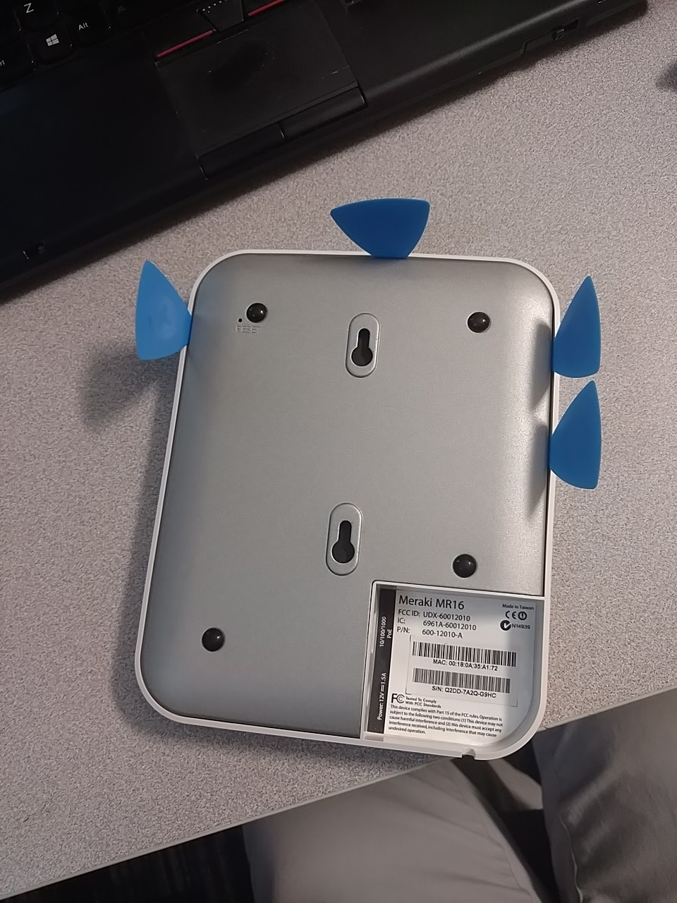
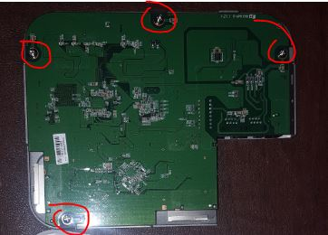

# Opening MR12/16
You will need
- T5 TORX screwdriver
- Philips screwdriver
- some sort of prying tools (spudgers work well)

- Unscrew the two screws on either end of the device
 - Notes: They are somtimes covered in tape, you can push your Torx screwdriver into it to unscrew through the tape.
 
  
 
- Remove the metal cover from the plastic cover
  - You will need to pry the plastic away from the metal to release the clips
  - The best way to do this is by wedging in guitar-style opening picks between each clip and its mate, then picking one clip to leverage up with a flat-head screwdriver; pictured below

  

- Once removed, unscrew the board from the metal casing

  

# Prepearing to Flashing MR12/16
You will need
 - Machine used for flashing
 - USB TTL Cable
 - Power cable or POE
 - Network Cable

**on flashing machine**

```
screen /dev/ttyUSB0 115200 # usually requires superuser, so try sudo instead
```

Windows> You can use PUTTY, select Serial, then the COM port found in Device Manager, and baud of 115200


***on MR12/16***
- Connect TTL
   - J1 on board
   - Indicator arrow for pin 1
```
Pin 1 - unpopulated VCC (DO NOT connect the RED wire)
Pin 2 (RX) - White (TX)
Pin 3 (TX) - Green (RX)
Pin 4 (GND) - Black GND
```
  - if no output, flip PIN 2 and 3 and power cycle  
- Press a key when `hit any key to stop autoboot` appear.
- If you miss it and you are not at the `ar7240>` prompt rebot and try again
 - Hint - you can spam the SPACE bar durring boot, just make sure you press enter after you get in to clear the prompt
 - Hint - you can avoid powercycling the MR12/16 by issuing  the `reboot` command at the linux primpt

## Expected output from MR12

```
Virian External MII mode MDC CFG Value ==> 6
: cfg1 0xf cfg2 0x7014
eth0 link down
eth0: 00:03:7f:e0:00:2a
ATHRSF1_PHY: PHY unit 0x0, address 0x4, ID 0xd04e,
ATHRSF1_PHY: Port 0, Neg Success
ATHRSF1_PHY: unit 0 port 0 phy addr 4
eth0 up
eth0
RESET is un-pushed
Hit any key to stop autoboot:  0
ar7240>
```

 ***on flashing machine***
- Install tftpd
```
apt-get install tftpd-hpa
cd /var/lib/tftpboot/
```

- Get binaries and place them in a TFTP root directory

```
wget https://downloads.openwrt.org/releases/18.06.2/targets/ar71xx/generic/openwrt-18.06.2-ar71xx-generic-mr12-squashfs-kernel.bin
wget https://downloads.openwrt.org/releases/18.06.2/targets/ar71xx/generic/openwrt-18.06.2-ar71xx-generic-mr12-squashfs-rootfs.bin

OR

wget https://downloads.openwrt.org/releases/18.06.2/targets/ar71xx/generic/openwrt-18.06.2-ar71xx-generic-mr16-squashfs-kernel.bin
wget https://downloads.openwrt.org/releases/18.06.2/targets/ar71xx/generic/openwrt-18.06.2-ar71xx-generic-mr16-squashfs-rootfs.bin
```

- add 192.168.1.101 to your computer's ip range
```
ifconfig enp3s0:1 192.168.1.101/24
```

Windows> You can use [TFTP Server](http://tftpd32.jounin.net/tftpd32_download.html),configure the tftpd folder. then set your computer's ip to 192.168.1.101

# FLASHING
***on MR12/16***

- Flash the board over uboot. Commands as follows
   - Download the kernel to memory
   - Erase the flash where the image will be
   - Copy image from memory to flash
   - Download and flash the rootfs same way
   - Set the starting point of the kernel
   - Save settings
- Note: MR12 and MR16 have differnt starting points for these files
- Note: copy paste each line individualy

## MR12
```
tftpboot 0x80010000 openwrt-18.06.2-ar71xx-generic-mr12-squashfs-kernel.bin;
erase 0x9fda0000 +0x240000;
cp.b 0x80010000 0x9fda0000 0x240000;

tftpboot 0x80010000 openwrt-18.06.2-ar71xx-generic-mr12-squashfs-rootfs.bin;
erase 0x9f080000 +0xD20000;
cp.b 0x80010000 0x9f080000 0xD20000;

setenv bootcmd bootm 0x9fda0000; 
saveenv;
```

## MR16
```
tftpboot 0x80010000 openwrt-18.06.2-ar71xx-generic-mr16-squashfs-kernel.bin;
erase 0xbfda0000 +0x240000;
cp.b 0x80010000 0xbfda0000 0x240000;

tftpboot 0x80010000 openwrt-18.06.2-ar71xx-generic-mr16-squashfs-rootfs.bin;
erase 0xbf080000 +0xD20000;
cp.b 0x80010000 0xbf080000 0xD20000;

setenv bootcmd bootm 0xbfda0000;
saveenv;

```

### 2 LINE FLASH:

Same as above but in only 2 lines
```
tftpboot 0x80010000 openwrt-18.06.2-ar71xx-generic-mr16-squashfs-kernel.bin; erase 0xbfda0000 +0x240000; cp.b 0x80010000 0xbfda0000 0x240000; 

tftpboot 0x80010000 openwrt-18.06.2-ar71xx-generic-mr16-squashfs-rootfs.bin; erase 0xbf080000 +0xD20000; cp.b 0x80010000 0xbf080000 0xD20000;  setenv bootcmd bootm 0xbfda0000; saveenv; boot;
```
## Expected output for MR12
```
ar7240> tftpboot 0x80010000 openwrt-18.06.2-ar71xx-generic-mr12-squashfs-kernel.bin
Trying eth0
Using eth0 device
TFTP from server 192.168.1.101; our IP address is 192.168.1.2
Filename 'openwrt-18.06.2-ar71xx-generic-mr12-squashfs-kernel.bin'.
Load address: 0x80010000
Loading: #################################################################
         #################################################################
         #################################################################
         #################################################################
         #########
done
Bytes transferred = 1376970 (1502ca hex)
ar7240> erase 0x9fda0000 +0x240000
Erase Flash from 0x9fda0000 to 0x9ffdffff in Bank # 1
First 0xda last 0xfd sector size 0x10000                                                                                                         253
Erased 36 sectors
ar7240> cp.b 0x80010000 0x9fda0000 0x240000
Copy to Flash... write addr: 9fda0000
done

```

- Finally boot the device

```
boot
```

## Expected output for MR12
```
ar7240> setenv bootcmd bootm 0x9fda0000;
ar7240> saveenv;
Saving Environment to Flash...
Protect off 9F040000 ... 9F04FFFF
Un-Protecting sectors 4..4 in bank 1
Un-Protected 1 sectors
Erasing Flash...Erase Flash from 0x9f040000 to 0x9f04ffff in Bank # 1
First 0x4 last 0x4 sector size 0x10000                                                                                                                                                                                                      4
Erased 1 sectors
Writing to Flash... write addr: 9f040000
done
Protecting sectors 4..4 in bank 1
Protected 1 sectors
ar7240> boot
## Booting image at 9fda0000 ...
   Image Name:   MIPS OpenWrt Linux-4.9.152
   Created:      2019-01-30  12:21:02 UTC
   Image Type:   MIPS Linux Kernel Image (lzma compressed)
   Data Size:    1376906 Bytes =  1.3 MB
   Load Address: 80060000
   Entry Point:  80060000
   Verifying Checksum ... OK
   Uncompressing Kernel Image ... OK
No initrd
## Transferring control to Linux (at address 80060000) ...
## Giving linux memsize in bytes, 67108864

Starting kernel ...

```

# Expected output from MR16

```
U-Boot 1.1.4-g5416eb09-dirty (Mar  3 2011 - 16:28:15)

AP96 (ar7100) U-boot 0.0.1 MERAKI
DRAM:  b8050000: 0xc0140180
64 MB
Top of RAM usable for U-Boot at: 84000000
Reserving 228k for U-Boot at: 83fc4000
Reserving 192k for malloc() at: 83f94000
Reserving 44 Bytes for Board Info at: 83f93fd4
Reserving 36 Bytes for Global Data at: 83f93fb0
Reserving 128k for boot params() at: 83f73fb0
Stack Pointer at: 83f73f98
Now running in RAM - U-Boot at: 83fc4000
id read 0x100000ff
flash size 16MB, sector count = 256
Flash: 16 MB
*** Warning - bad CRC, using default environment

In:    serial
Out:   serial
Err:   serial
Net:   ag7100_enet_initialize...
ATHRF1E: Port 0, Negotiation timeout
ATHRF1E: unit 0 phy addr 0 ATHRF1E: reg0 1000
eth0: 00:03:7f:e0:00:62
eth0 up
No valid address in Flash. Using fixed address
ATHRF1E: Port 1, Negotiation timeout
ATHRF1E: unit 1 phy addr 1 ATHRF1E: reg0 ffff
eth1: 00:03:7f:09:0b:ad
eth1 up
eth0, eth1
RESET is un-pushed
Hit any key to stop autoboot:  0
ar7100> tftpboot 0x80010000 openwrt-18.06.2-ar71xx-generic-mr16-squashfs-kernel.bin;
Trying eth0
Using eth0 device
TFTP from server 192.168.1.101; our IP address is 192.168.1.2
Filename 'openwrt-18.06.2-ar71xx-generic-mr16-squashfs-kernel.bin'.
Load address: 0x80010000
Loading: #################################################################
         #################################################################
         #################################################################
         #################################################################
         #########
done
Bytes transferred = 1376952 (1502b8 hex)
ar7100> erase 0xbfda0000 +0x240000;
Erase Flash from 0xbfda0000 to 0xbffdffff in Bank # 1
First 0xda last 0xfd sector size 0x10000                                     253
Erased 36 sectors
ar7100> cp.b 0x80010000 0xbfda0000 0x240000;
Copy to Flash... write addr: bfda0000
done
ar7100> tftpboot 0x80010000 openwrt-18.06.2-ar71xx-generic-mr16-squashfs-rootfs.bin;
Trying eth0
Using eth0 device
TFTP from server 192.168.1.101; our IP address is 192.168.1.2
Filename 'openwrt-18.06.2-ar71xx-generic-mr16-squashfs-rootfs.bin'.
Load address: 0x80010000
Loading: #################################################################
         #################################################################
         #################################################################
         #################################################################
         #################################################################
         #################################################################
         ###########################################################
done
Bytes transferred = 2293764 (230004 hex)
ar7100> erase 0xbf080000 +0xD20000;
Erase Flash from 0xbf080000 to 0xbfd9ffff in Bank # 1
First 0x8 last 0xd9 sector size 0x10000                                      217
Erased 210 sectors
ar7100> cp.b 0x80010000 0xbf080000 0xD20000;
Copy to Flash... write addr: bf080000
done
ar7100> setenv bootcmd bootm 0xbfda0000;
ar7100> saveenv;
Saving Environment to Flash...
Protect off BF040000 ... BF04FFFF
Un-Protecting sectors 4..4 in bank 1
Un-Protected 1 sectors
Erasing Flash...Erase Flash from 0xbf040000 to 0xbf04ffff in Bank # 1
First 0x4 last 0x4 sector size 0x10000                                         4
Erased 1 sectors
Writing to Flash... write addr: bf040000
done
Protecting sectors 4..4 in bank 1
Protected 1 sectors
ar7100> 
```

# Configuring MAC

Mac address needs to be configured to work properly, otherwase a default mac address is used. Check the plastic case for the stricker indicating the MAC address.

MAC shows as xx:xx:xx:xx:xx:xx
Example Below: 00:18:0a:33:44:55

Simple remove `:` and repend eash set of two with `\x`

In the openwrt prompt

```
mtd erase mac
echo -n -e '\x00\x18\x0a\x33\x44\x55' > /dev/mtd5
echo -n -e '\x00\x18\x0a\x35\xbc\x30' > /dev/mtd5

sync && reboot
```

## Excpected output

```
root@opwenwrt:/# mtd erase mac
Unlocking mac ...
Erasing mac ...
root@opwenwrt:/# echo -n -e '\x00\x18\x0a\x33\x44\x55' > /dev/mtd5
root@opwenwrt:/# sync && reboot
root@opwenwrt:/#
```
